# MiniCompiler 💽
___
## Description ✏️:
This is a mini-compiler with a simple IDE made on Godot Engine for my class about Languages and Automatons II.
___
## Language Definition 📃:
This language supports:
- static typed
- structured programation
- 3 data types: **Integer, Decimal & String**
- A control structure
- An iteration structure
- Logical & Arithmetic operators
- An instruction for input
- An instruction for output

### The alphabet 🔤
∑ = {a, b, c,…,z, A, B, C, …, 0, 1, 2, …, 9, ;, =, +, -, /, *, (, ), <, >, #}

### Keywords 🔑
| Keyword | Description |
| ----------- | ----------- |
| int | Data type for whole numbers |
| double | Data type for floating point numbers |
| while | Iteration structure |
| if | Control structure for conditional statements |
| else | Used in conditional statements |
| elif | Used in conditional statements |
| and | Logical operator |
| or | Logical operator |
| not | Logical operator |

### Commentaries #️⃣
You can make commentaries with the ***"#"*** symbol.
`# This is a commentary`

### Finite Automatons 💻

#### Language

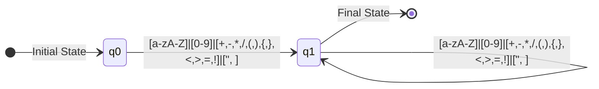

#### Keywords

##### int
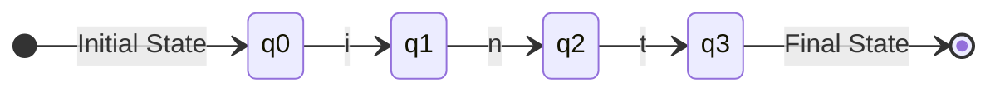

##### double
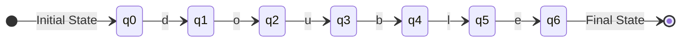

##### while
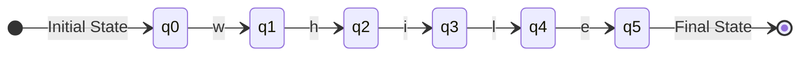

##### if
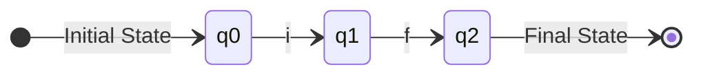

##### else
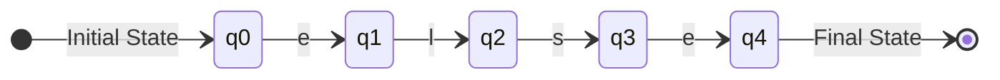

##### elif
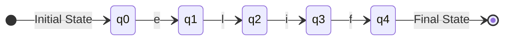

##### and
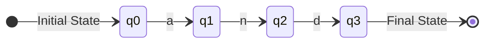

##### or
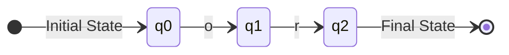

##### not
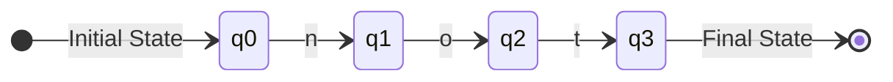

### Syntax & Grammar 🗣️

#### EBNF

##### Make a program
```
program ::= statement+
```

##### Make a statement
```
statement ::= assignement| ifstatement | whilestatement | forstatement | output | input
assignement ::= datatype identifier "=" expression ";"
identifier ::= letter|special idrest*
idrest ::= letter|special|digit
output ::= "print" "''text''" 
input ::= "read" identifier
text ::= letter*
letter ::= "a"|"b"|"c"|"d"|"e"|"f"|"g"|"h"|"i"|"j"|"k"|"l"|"m"|"n"|"o"|"p"|"q"|"r"|"s"|"t"|"u"|"v"|"w"|"u"|"v"|"w"|"x"|"y"|"z"
|"A"|"B"|"C"|"D"|"E"|"F"|"G"|"H"|"I"|"J"|"K"|"L"|"M"|"N"|"O"|"P"|"Q"|"R"|"S"|"T"|"U"|"V"|"W"|"X"|"Y"|"Z"
digit ::= "0"|"1"|"2"|"3"|"4"|"5"|"6"|"7"|"8"|"9"
special ::= "_"|"$"
datatype ::= "int"|"double"|"chars"
ifstatement::= "if" condition codeblock
whilestatement ::= "while" condition codeblock
forstatement ::= "for" "(" assignement expression";" expression  ")" codeblock
codeblock ::= "{" statement+ "}"
condition ::= "("  expression  ")"
expression ::= term ( "+" | "-" term)*
term ::= unary ( "/" | "*" | "<" | ">" | "<=" | ">=" | "==" | "!=" unary)*
unary ::= ("+" | "-")* primary
primary ::= digit | identifier | text
```
#### Syntax Diagrams
I use the next web app for making the diagrams: [https://dundalek.com/grammkit/](https://dundalek.com/grammkit/)


#### Syntax Tree

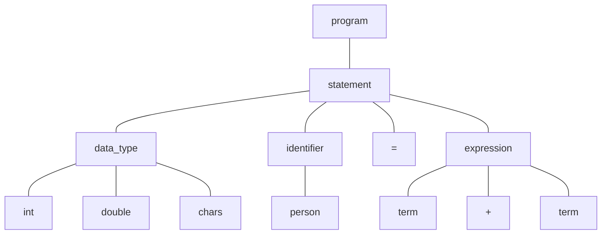

### Implementation 🧑‍💻
**//TODO**
It can be a compiler or an interpreter, just need to do the process every typed keyword event for being an interpreter, or a compiler if the proccess is done by pressing a button.

### Code examples 
**//TODO**

### Use cases
**//TODO**

### Future Improvements
**//TODO**
___

### Incident Log

| Date | Incident | Solution |
| ----------- | ----------- | ----------- |
|  2023/10/29 at 15:00 | Lexemas are misformed | The function substr in Godot Engine, takes the start position and the length of the substring. I thought that I nedeed to pass the end position, for that my lexemas were misformed. I just changed the arguments in the function | 
| 2023/10/29 at 18:00 | Commentaries arise a lexical error message. | I forgot to recognized the new lines, I thought that it wasn't really important, but it is. |

## TODO ✅
- [x] Lexer
- [ ] Improve documentation
- [ ] Improve GUI
- [ ] Parser
- [ ] Semantic
- [ ] Translate code to GDScript
___
## References 🔗
I'm reading this blog, it is really good:
<https://austinhenley.com/blog/teenytinycompiler1.html>
